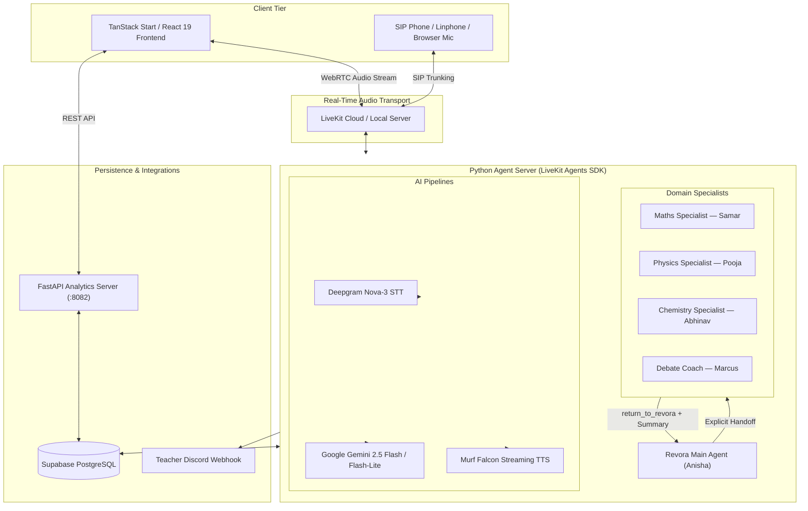

# Revora AI

> **A voice-first AI learning companion and combat-style revision coach for Class 11 students across India.**

Built for the **10 Days of Voice Agents — #VoiceForBharat Edition** powered by **Murf AI (Murf Falcon TTS)**, **LiveKit**, **Deepgram**, and **Google Gemini**.

---

## Demo & Repository

- **GitHub Repository**: `https://github.com/AadarshJain07/murf-livekit-starter/edit/day10`

---

## Problem

Students across India—from school learners to those preparing for competitive exams like JEE and NEET—face vast syllabi in Physics, Chemistry, Mathematics, and other subjects. This can lead to conceptual overload, passive reading fatigue, and a lack of personalized support during self-study.

Traditional text-based chat apps often fail to replicate the dynamic, interactive rhythm of an authentic one-on-one tutor. Revora AI solves this with voice, enabling students to ask questions, discuss concepts, practice, and learn through natural conversations.

1. **Active Recall over Passive Scrolling**: Conversational quizzing and teach-back challenges force students to articulate explanations aloud, solidifying understanding.
2. **Multilingual & Natural**: Speaks English, pure Hindi (Devanagari script), and colloquial Hinglish naturally without forced code-switching.
3. **Domain Specialist Handoffs**: Automatically connects learners with dedicated subject specialists when deep conceptual help is requested.
4. **Gamified Voice Quests & Boss Battles**: Converts dry textbook revision into XP-driven boss fights and combat revision sessions.
5. **Human Safety & Teacher Escalation**: Safe guardrails that filter private data and escalate stuck concepts to human teachers via tickets and Discord alerts.

---

## Key Features

Every feature listed below is fully implemented and verified in the codebase:

- **Murf Falcon Real-Time TTS**: Ultra-low latency conversational voice generation powered by Murf Falcon with conversational pacing and sentence tokenization.
- **Multilingual Mastery (English, Hindi, Hinglish)**: Dynamically adapts to the student's spoken language. Hindi is written in native Devanagari script; English conversations stay strictly in English.
- **Personality & Safety Guardrails**: Encouraging, patient, non-judgmental tone. Built-in regex sanitizers strip sensitive credentials (passwords, OTPs, PINs, Aadhaar, account numbers) from all persistence logs.
- **Consent-First Student Memory**: Saves student preferences, name, class level, topics covered, and common mistakes to Supabase PostgreSQL only after explicit verbal consent.
- **Gamified Voice Quests & Boss Battles**: Adaptive difficulty scaling (easy, medium, hard), real-time XP accumulation, damage calculation against subject bosses (Newton, Mendeleev, Euler, Darwin), and teach-back evaluation.
- **Practice Tools (`get_next_exercise`)**: Accesses structured Class 11 questions across Physics, Chemistry, Mathematics, and Biology.
- **Outbound Practice Calls (LiveKit SIP)**: Automated outbound SIP dispatching (`make_call.py`) for scheduled daily revision reminders and Linphone softphone compatibility.
- **Teacher Escalation & Support Tickets**: Generates human-speakable reference IDs (`REV-XXXXX`), records issue summaries to Supabase, and posts formatted alert embeds to a teacher Discord webhook.
- **Call Analytics & State Persistence**: Real-time analytics tracking call duration, channel (`browser` or `sip`), quest success rates, topic mastery percentages, and weak concept detection.
- **Autonomous Multi-Specialist Router**:
  - **Maths Specialist — Samar** (`samar` voice): Step-by-step calculus, algebra, trigonometry, and coordinate geometry coaching.
  - **Physics Specialist — Pooja** (`pooja` voice): Intuitive mechanics, kinematics, unit analysis, and numerical problem decomposition.
  - **Chemistry Specialist — Abhinav** (`abhinav` voice): Mole concept calculations, atomic structure, periodic trends, and bonding.
  - **Debate Mode — Marcus** (`marcus` voice): Intellectual sparring partner challenging student logic and building argumentation skills.
- **Structured Return Summaries**: Specialists complete their sessions and return the learner back to Revora with a structured diagnostic summary (topic covered, questions attempted, accuracy, and weak concepts).
- **Supabase Cloud Persistence**: Relational PostgreSQL database tracking sessions, attempts, memory, and escalations.

---

## How It Works

Revora acts as an intelligent router and voice coach. The audio pipeline operates seamlessly in real time:

```
Student Speaks ──► LiveKit WebRTC / SIP ──► Deepgram Nova-3 STT ──► Google Gemini LLM
                                                                           │
                                                                           ▼
Student Hears ◄── Murf Falcon TTS (Anisha/Samar/Pooja/Abhinav/Marcus) ◄── Agent Engine
                                                                           │
                                                                           ▼
                                                             [Supabase DB / Memory / Tools]
```

### Routing & Specialist Flow

1. **Revora Main Agent** (`anisha` voice): Answers general study queries, manages quests, and handles general revision across all subjects.
2. **Explicit Specialist Handoff**: When a student explicitly requests a specialist (e.g., *"Connect me to the Maths specialist"*), Revora:
   - Announces the handoff verbally: *"Sure, I'll connect you to our Maths Specialist."*
   - Extracts student context (name, language, current topic, known weak concepts) from Supabase.
   - Transfers control to the domain specialist without asking the student to repeat themselves.
3. **Structured Return**: Once the specialist finishes or the student changes subjects, the specialist calls `return_to_revora`, passing a structured learning summary for seamless remediation.
4. **Debate Mode**: When entering Debate Mode, the agent adopts a devil's advocate persona to challenge assumptions, hone critical thinking, and demand evidence.

---

## Architecture



---

## Tech Stack

### Backend & AI Pipeline
- **Runtime**: Python 3.10+ (managed with `uv`)
- **Voice Engine**: [Murf Falcon TTS](https://murf.ai/) (`livekit-murf`)
- **Speech-to-Text**: Deepgram Nova-3 (`livekit-plugins-deepgram`)
- **Language Model**: Google Gemini (`livekit-plugins-google`)
- **Transport & Agents**: LiveKit Agents SDK (`livekit-agents`), Silero VAD, Multilingual Turn Detector
- **API Server**: FastAPI, Uvicorn, Requests
- **Database**: Supabase PostgreSQL (`supabase-py`, REST bridge)

### Frontend & Dashboard
- **Framework**: TanStack Start (React 19, TypeScript, Nitro)
- **Styling**: Tailwind CSS v4, Lucide React icons, Radix UI
- **Real-Time Client**: LiveKit Client SDK (`livekit-client`)
- **State & Data**: TanStack Query (`@tanstack/react-query`)

---

## Project Structure

```
murfagents/
├── murf-livekit-starter/
│   └── backend/
│       ├── src/
│       │   ├── agent.py                 # Core LiveKit Assistant & function tools
│       │   ├── prompt.py                # System prompt, guardrails & multilingual rules
│       │   ├── specialists.py           # BaseSpecialist & Maths/Physics/Chemistry/Debate classes
│       │   ├── specialist_prompts.py    # Pedagogy instructions for domain tutors
│       │   ├── maths_specialist.py      # Maths tutor module (Samar voice)
│       │   ├── physics_specialist.py    # Physics tutor module (Pooja voice)
│       │   ├── chemistry_specialist.py  # Chemistry tutor module (Abhinav voice)
│       │   ├── debate_specialist.py     # Debate coach module (Marcus voice)
│       │   ├── quest.py                 # Gamified Quest engine, XP, damage & mastery
│       │   ├── memory.py                # Consent-based student memory store
│       │   ├── escalations.py           # Teacher escalation tickets & Discord notifications
│       │   ├── make_call.py             # Outbound SIP practice call trigger script
│       │   ├── outbound.py              # Outbound telephony job parsing & dispatch
│       │   ├── supabase_client.py       # Resilient Supabase database client bridge
│       │   └── api_server.py            # FastAPI analytics endpoint server
│       ├── tests/
│       │   ├── test_router.py           # Unit tests for router prompt, voices & tools
│       │   ├── test_flow_simulation.py  # End-to-end handoff simulation tests
│       │   └── test_agent.py            # LLM-as-judge evaluation suite
│       ├── pyproject.toml               # Python dependencies & configuration
│       └── Dockerfile                   # Production container definition
├── src/
│   ├── routes/
│   │   ├── index.tsx                    # Main interactive voice orb & learning studio
│   │   ├── quest.tsx                    # Quest progress, mastery HUD & streak dashboard
│   │   ├── support.tsx                  # Teacher escalation & ticket tracking view
│   │   └── api/                         # LiveKit token & database API endpoints
│   ├── components/
│   │   └── Revora/                      # VoiceOrb, Waveform, QuestHUD, RequestCallModal
│   └── lib/                             # Supabase client & RPC query helpers
├── supabase/
│   └── migrations/                      # PostgreSQL DDL for tables & RLS policies
└── package.json                         # Frontend dependencies & build scripts
```

---

## Setup & Installation

### Prerequisites

- **Node.js**: 20+ and npm / pnpm
- **Python**: 3.10 to 3.14 (recommended: install [`uv`](https://docs.astral.sh/uv/))
- **LiveKit Cloud account** (or local LiveKit server)
- **Murf AI API Key**
- **Deepgram API Key**
- **Google AI Studio API Key** (for Gemini)
- **Supabase Project**

---

### 1. Environment Configuration

#### Backend Configuration
Copy the sample environment file in `murf-livekit-starter/backend/`:

```bash
cd murf-livekit-starter/backend
cp .env.example .env.local
```

Configure the following variables in `murf-livekit-starter/backend/.env.local`:

```env
# LiveKit Transport
LIVEKIT_URL=wss://your-project.livekit.cloud
LIVEKIT_API_KEY=your_livekit_api_key
LIVEKIT_API_SECRET=your_livekit_api_secret

# AI Models & Voice
MURF_API_KEY=your_murf_api_key
DEEPGRAM_API_KEY=your_deepgram_api_key
GOOGLE_API_KEY=your_gemini_api_key

# Outbound SIP (Optional — for telephony)
SIP_OUTBOUND_TRUNK_ID=ST_xxxxxxxxxxxx
SIP_USERNAME=your_sip_username
SIP_PASSWORD=your_sip_password
AGENT_NAME=my-agent

# Supabase Persistence
SUPABASE_URL=https://your-project.supabase.co
SUPABASE_SERVICE_ROLE_KEY=your_supabase_service_role_key
REVORA_API_URL=http://localhost:3000
REVORA_API_KEY=your_internal_bridge_key
```

#### Frontend Configuration
Configure `.env.local` in the root project directory:

```env
LIVEKIT_URL=wss://your-project.livekit.cloud
LIVEKIT_API_KEY=your_livekit_api_key
LIVEKIT_API_SECRET=your_livekit_api_secret
SUPABASE_URL=https://your-project.supabase.co
SUPABASE_ANON_KEY=your_supabase_anon_key
```

---

### 2. Database Migration (Supabase)

Run the migration scripts located in `supabase/migrations/` in your Supabase SQL Editor:
- `20260814092549_5dc65aa8-3da0-4f4b-bddd-7a112d724a55.sql`: Creates `quest_sessions`, `quest_attempts`, `user_memory`, and `escalations`.
- `20260814120800_allow_anon_policies.sql`: Enables appropriate Row Level Security (RLS) policies.

---

### 3. Backend Setup & Startup

From the `murf-livekit-starter/backend` directory:

```bash
cd murf-livekit-starter/backend

# Install dependencies using uv
uv sync

# Download Silero VAD and Turn Detector models
uv run python src/agent.py download-files

# Start the LiveKit voice agent worker in development mode
uv run python src/agent.py dev
```

*(Optional) Start the FastAPI Analytics Server in a separate terminal:*

```bash
cd murf-livekit-starter/backend
uv run python src/api_server.py
```

---

### 4. Frontend Setup & Startup

From the repository root directory:

```bash
# Install node dependencies
npm install

# Start Vite dev server
npm run dev
```

Open [http://localhost:3000](http://localhost:3000) in your browser to interact with Revora AI.

---

### 5. Testing the Agent

#### Run Automated Test Suites
Run the full router and flow simulation tests with pytest:

```bash
cd murf-livekit-starter/backend
uv run pytest tests/test_router.py tests/test_flow_simulation.py -v
```

#### Test Outbound Call (SIP)
To dispatch a practice call to a phone number or SIP URI:

```bash
cd murf-livekit-starter/backend
uv run python src/make_call.py +919876543210 --subject Physics
```

---

## Specialist Agents

Revora implements an autonomous **Multi-Specialist Learning Router**:

| Specialist | Voice (Murf) | Domain Focus | Activation Trigger |
| :--- | :--- | :--- | :--- |
| **Revora (Main)** | `anisha` | General Coaching, Router, Quests, Memory | Default Assistant |
| **Maths Specialist** | `samar` | Algebra, Calculus, Trigonometry, Step Solutions | *"Connect me to the Maths specialist"* |
| **Physics Specialist** | `pooja` | Kinematics, Dynamics, Forces, Numerical Breakdown | *"I want to talk to the Physics specialist"* |
| **Chemistry Specialist** | `abhinav` | Mole Concept, Atomic Structure, Bonding | *"Speak with the Chemistry expert"* |
| **Debate Coach** | `marcus` | Logical Argumentation, Critical Thinking | *"Switch to Debate Mode"* |

### Key Handoff Principles
1. **Explicit Request Only**: General questions are answered directly by Revora. Specialists are only engaged upon explicit student request.
2. **Zero Context Loss**: The student's name, language preference, topic, and prior mistakes are passed into the specialist's prompt. The student is never asked to repeat themselves.
3. **Seamless Return**: When finished, specialists summarize progress (attempts, accuracy, weak spots) back to Revora via `return_to_revora`.

---

## Debate Mode

Debate Mode transforms the voice agent into an intellectual sparring partner. Instead of merely answering questions:
- It challenges assumptions and tests the learner's arguments with counter-questions.
- It identifies logical fallacies and encourages students to support claims with scientific principles or real-world evidence.
- It sharpens critical thinking and communication skills essential for competitive examinations.

---

## Data & Security

- **Strict Privacy Sanitization**: The sanitization engine checks all inbound parameters against known sensitive patterns (passwords, OTPs, PINs, Aadhaar numbers, card numbers) and redacts them before storing to PostgreSQL.
- **Explicit Consent**: Student memory is only committed to the database after clear verbal agreement.
- **Credential Hygiene**: API keys and secrets are loaded strictly from `.env.local` and excluded from version control via `.gitignore`.

---

## The 10-Day Journey

The evolution of Revora AI over the **10 Days of Voice Agents — #VoiceForBharat Edition**:

1. **Day 1 — Voice Agent**: Core WebRTC voice loop using Murf Falcon TTS and LiveKit.
2. **Day 2 — Personality & Prompting**: Establishing Revora as an encouraging, patient Class 11 tutor.
3. **Day 3 — Safety & Guardrails**: Enforcing sensitive data redaction and harmful content refusal.
4. **Day 4 — Multilingual Support**: English, Hindi (Devanagari), and natural Hinglish without language confusion.
5. **Day 5 — Persistent Memory**: Consent-driven student memory stored in PostgreSQL.
6. **Day 6 — Tools & Exercises**: Dynamic exercise fetching via `get_next_exercise`.
7. **Day 7 — Outbound Calling**: Proactive revision reminders over SIP telephony.
8. **Day 8 — Human Escalation**: Ticketing system with reference IDs and Discord alert webhooks.
9. **Day 9 — Call Analytics & Quests**: Gamified quest engine, XP tracking, damage calculation, and mastery detection.
10. **Day 10 — Multi-Specialist Handoffs & Debate Mode**: Dedicated subject specialists (Samar, Pooja, Abhinav), Debate Mode (Marcus), and structured return summaries.

---

## What I Learned

- **Streaming Latency Optimization**: Achieving true conversational latency requires optimizing every step — streaming STT with Deepgram Nova-3, rapid inference with Gemini, and sentence-level tokenized streaming with Murf Falcon TTS.
- **Stateful Voice Handoffs**: Orchestrating agent-to-agent handoffs in real-time voice demands careful context serialization so that the specialist enters the conversation smoothly without asking the user to repeat themselves.
- **Voice UX & Interactivity**: Spoken AI interactions require concise phrasing (under 80 words per turn), clear pacing, and natural turn detection to prevent awkward interruptions.
- **Resilience in Production**: Bridging WebRTC client rooms with persistent databases requires graceful error boundaries so transient database hiccups never drop an active voice call.

---

## Future Improvements

- **Visual Whiteboard Synchronization**: Real-time formula and diagram rendering on the frontend synced with voice explanations.
- **Formula Audio Parsing**: Enhanced phonetic pronunciation for complex mathematical LaTeX formulas.
- **Multi-Player Voice Quests**: Group study rooms where multiple students can collaborate to defeat subject bosses.
- **Regional Indian Languages**: Expanding support to Marathi, Tamil, Telugu, and Bengali voice models.

---

## Acknowledgements

- **10 Days of Voice Agents — VoiceForBharat Edition**
- Powered by **[Murf AI](https://murf.ai/)** & **Murf Falcon**
- Transport by **[LiveKit](https://livekit.io/)**
- Tag: **`#VoiceForBharat`**

---

## License

This project is licensed under the MIT License.
